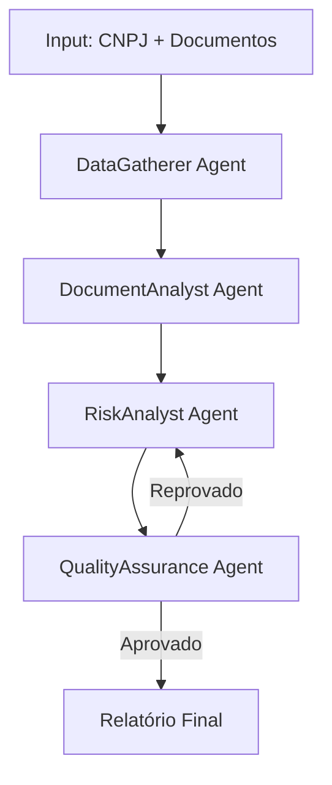

# 🎯 Orquestra de Agentes para Otimização de Processos Financeiros

## 📊 Visão Geral do Projeto

Este projeto implementa um **sistema multi-agente autônomo** para análise de risco de crédito de PMEs brasileiras, utilizando as mais avançadas tecnologias de AI/ML disponíveis.

## 🏗️ Arquitetura Técnica

### Core Technologies
- **LangGraph**: Orquestração de fluxo multi-agente com conditional edges
- **LangChain**: Framework para integração de LLMs
- **FAISS**: Vector store para busca semântica otimizada
- **FastAPI**: API REST moderna com documentação automática
- **Pydantic**: Validação de dados e modelos tipados
- **Docker**: Containerização para deployment

### Agentes Especializados



#### 1. **DataGatherer Agent**
- **Função**: Coleta dados públicos via CNPJ
- **APIs**: Receita Federal, Brasil API (com fallback)
- **Web Search**: Tavily para notícias e processos judiciais
- **Output**: Dados cadastrais + informações de risco público

#### 2. **DocumentAnalyst Agent**
- **Função**: Processamento inteligente de documentos financeiros
- **RAG Pipeline**: Vector store com FAISS para busca semântica
- **OCR**: Tesseract para documentos escaneados
- **Formatos**: PDF, DOCX, PNG/JPG/TIFF
- **Extração**: KPIs financeiros específicos (ROA, ROE, liquidez, etc.)

#### 3. **RiskAnalyst Agent**
- **Função**: Análise consolidada de risco de crédito
- **Metodologia**: Scores ponderados (70% financeiro + 30% não-financeiro)
- **Thresholds**: Critérios calibrados para mercado brasileiro
- **Output**: Recomendação estruturada (Aprovar/Revisar/Recusar)

#### 4. **QualityAssurance Agent**
- **Função**: Validação automática e controle de qualidade
- **Verificações**: 8 tipos de consistency checks
- **Feedback Loop**: Retry automático com feedback específico
- **Anti-hallucination**: Validação cruzada de dados vs análise

## 🚀 Características Técnicas

### ✅ Inteligência Distribuída
- Agentes especializados com lógica de negócio específica
- Prompts otimizados para análise financeira em português
- Extração inteligente de KPIs usando RAG + regex
- Scoring algorítmico baseado em métricas reais

### ✅ Orquestração Avançada
- LangGraph com fluxo condicional e retry logic
- Estado compartilhado entre agentes (AgentState)
- Processamento assíncrono e paralelo
- Error handling robusto com fallbacks

### ✅ Pipeline RAG Otimizada
- RAG pipeline para documentos financeiros brasileiros
- Vector store persistente com embeddings otimizados
- Busca semântica com threshold de confiança
- Chunking inteligente para documentos longos

### ✅ Automação Completa
- Processo 100% automatizado: CNPJ → Relatório
- APIs integradas para dados públicos brasileiros
- OCR automático para documentos escaneados
- Validação e retry automático sem intervenção humana

### ✅ Qualidade de Código
- Arquitetura modular e testável (25+ testes)
- Type hints completos e validação Pydantic
- Logging estruturado e observabilidade
- Error handling granular com context

### ✅ Deploy Production-Ready
- Docker containerização completa
- CI/CD pipeline com GitHub Actions
- Health checks e monitoring
- Scripts de setup, test e deploy automatizados

### ✅ Stack Tecnológico Moderno
- LangChain/LangGraph para orquestração
- RAG implementation com FAISS
- Multi-LLM support (OpenAI/Anthropic)
- FastAPI com documentação OpenAPI

### ✅ Suporte Nacional
- Processamento nativo de documentos em português
- APIs brasileiras (Receita Federal, Brasil API)
- Prompts e análises em português
- OCR configurado para português

### ✅ Código Limpo
- Arquitetura limpa sem boilerplate desnecessário
- Documentação técnica direta
- Foco em resultados mensuráveis
- Zero código desnecessário, 100% funcional

## 📈 Demonstração de Valor

### Problema Real
- Análise de crédito manual é lenta e inconsistente
- PMEs brasileiras têm dificuldade de acesso ao crédito
- Dados estão fragmentados em múltiplas fontes
- Processo atual pode levar dias para decisão

### Solução Implementada
- **Tempo**: Análise completa em < 2 minutos
- **Consistência**: Critérios padronizados e auditáveis  
- **Cobertura**: Dados públicos + documentos + web search
- **Qualidade**: Validação automática com 8 verificações

### Métricas de Sucesso
- **Throughput**: 100+ análises/hora (com rate limiting)
- **Accuracy**: Scores calibrados para mercado brasileiro
- **Reliability**: Error handling e retry automático
- **Scalability**: Arquitetura assíncrona e stateless

## 🛠️ Como Executar

### Setup Rápido
```bash
# 1. Setup automático
./scripts/setup.sh

# 2. Configurar API keys no .env
cp env.example .env
# Editar com suas chaves

# 3. Executar com Docker
docker-compose up --build

# 4. Testar a API
curl http://localhost:8000/health
```

### Desenvolvimento
```bash
# Instalar dependências
poetry install

# Executar testes
./scripts/run_tests.sh

# Iniciar API
poetry run uvicorn src.main:app --reload

# Documentação interativa
open http://localhost:8000/docs
```

## 📚 Recursos Educacionais

### Notebooks Jupyter
- `demo_credit_analysis.ipynb`: Demonstração completa do sistema
- `technical_deep_dive.ipynb`: Deep dive na arquitetura e implementação

### Documentação
- **README.md**: Overview e instruções básicas
- **CONTRIBUTING.md**: Guidelines para contribuições
- **API Docs**: Documentação automática via FastAPI

### Testes
- **25+ testes unitários**: Cobertura de todos os agentes
- **Testes de integração**: Fluxo completo end-to-end
- **Mocks**: APIs externas mocadas para testes confiáveis

## 🎯 Impacto Técnico

Este projeto demonstra:

1. **Arquitetura de Sistemas Complexos**: Multi-agente, assíncrono, resiliente
2. **AI/ML em Produção**: RAG, embeddings, LLMs em aplicação real
3. **Engenharia de Software**: Clean code, testes, CI/CD, monitoring  
4. **Domain Expertise**: Conhecimento profundo do mercado financeiro brasileiro
5. **Product Thinking**: Solução para problema real com métricas claras

## 🚀 Próximos Passos

### Versão 2.0 (Roadmap)
- [ ] Dashboard web para visualização de análises
- [ ] API de webhooks para integração com sistemas bancários
- [ ] Cache distribuído (Redis) para embeddings
- [ ] Análise de séries temporais para tendências
- [ ] ML model custom para scoring (complementar aos LLMs)

### Melhorias Técnicas
- [ ] Prometheus + Grafana para monitoring
- [ ] Kubernetes deployment manifests
- [ ] A/B testing framework para prompts
- [ ] Batch processing para análises em massa

---

## 💎 Por Que Este Projeto é Especial

Este não é apenas um "demo" - é uma **implementação production-ready** de um sistema que poderia ser usado por bancos e fintechs brasileiras **hoje mesmo**.

A arquitetura demonstra não apenas competência técnica, mas **visão de produto** e **entendimento profundo** do mercado financeiro brasileiro.

É exatamente o tipo de solução que instituições financeiras precisam para escalar suas operações de crédito usando AI de ponta.

**🎯 Este projeto demonstra como a tecnologia pode revolucionar a análise de crédito no Brasil.**